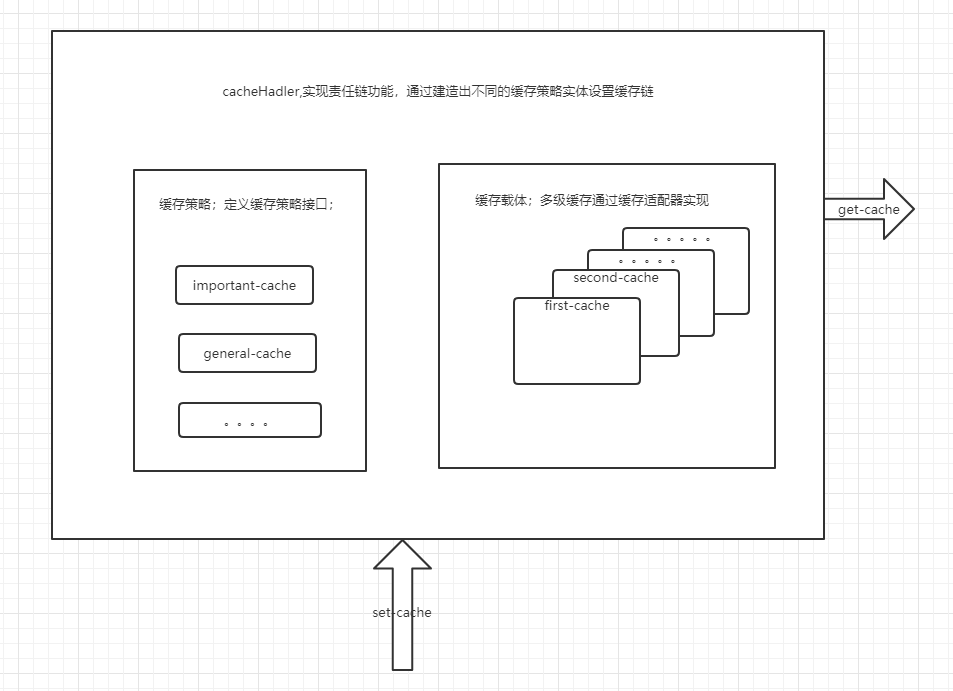
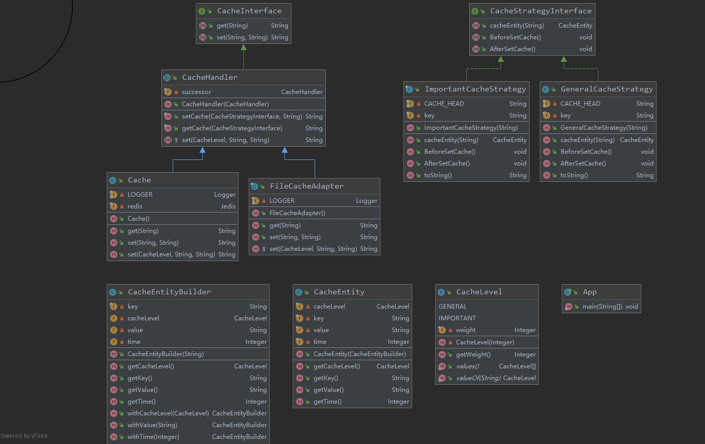

# **多级缓存模型demo**

* 责任链模式（Chain Of Responsibilities）
  >建立一个对象链来按指定顺序处理调用。如果其中一个对象无法处理命令，它会委托这个调用给它的下一个对象来进行处理，以此类推。
   
* 适配器模式（Adapter）
  >将一个类的接口转换成可应用的兼容接口。适配器使原本由于接口不兼容而不能一起工作的那些类可以一起工作。

* 建造者模式（Builder）
   >建造者是创建一个复杂对象的一部分接口。  
   有时候，如果建造者对他所创建的东西拥有较好的知识储备，这个接口就可能成为一个有默认方法的抽象类（又称为适配器）。  
   如果对象有复杂的继承树，那么对于建造者来说，有一个复杂继承树也是符合逻辑的。

* 策略模式（Strategy）
   >分离「策略」并使他们之间能互相快速切换。此外，这种模式是一种不错的继承替代方案（替代使用扩展抽象类的方式）。

  

  

### 面向对象设计7原则
* 单一职责原则（Single Responsibility Principle, SRP）
  >核心思想：解耦和增强内聚性（高内聚，低耦合）  
   类被修改的几率很大，因此应该专注于单一的功能。如果你把多个功能放在同一个类中，功能之间就形成了关联，改变其中一个功能，有可能中止另一个功能，这时就需要新一轮的测试来避免可能出现的问题

* 开闭原则（Open-Closed Principle, OCP）
  > 核心思想：对扩展开放，对修改关闭  
    扩展开放：模块添加新功能，不改变原有的代码  
    修改关闭：某模块被其他模块调用，如果该模块的源代码不允许修改，则该模块修改关闭的

* 里氏替换原则（Liskov Substitution Principle, LSP）
  >核心思想：任何父类出现的地方，子类都可以替代出现
                                               
* 依赖倒转原则（Dependence Inversion Principle, DIP）
  >核心思想：要依赖于抽象，不要依赖于具体的实现
                                                
* 接口分离原则（Interface Segregation Principle, ISP）
  >核心思想：不应该强迫客户程序依赖他们不需要使用的方法  
   一个接口不需要提供太多的行为，一个接口应该只提供一种对外的功能，不应该把所有的操作都封装到一个接口当中
                                                
* 合成复用原则（Composite Reuse Principle, CRP）
  >核心思想：尽量使用对象组合，而不是继承来达到复用的目的  
   继承关系是强耦合，组合关系是低耦合
                                          
* 迪米特原则（Law of Demeter, LoD）
  >又称最少知识原则  
   核心思想：一个对象应当对其他对象有尽可能少的了解,不和陌生人说话
   降低各个对象之间的耦合，提高系统的可维护性